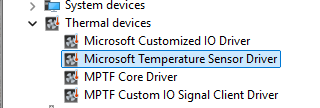

# MPTF Drivers

There is 3 primary drivers involved in MPTF 
 - MPTF Core Driver
 - Microsoft Customized IO Driver
 - MPTF Customize IO Signal Client
 
All these drivers are included in OS drops after 26394 as part of the default OS build.

 ## MPTF Core Driver
The Core Driver provides the core logic for MPTF, reads the configuration blob and operates on input and output devices. This driver will not be loaded unless you add the following ACPI entry to load the driver automatically at boot time.

 ```
 // MPTFCore Driver
Device(MPC0) {
  Name(_HID, "MSFT000D")
  Name (_UID, 1)

}
```

You can find this driver under windows driverstore folder

`C:\Windows\System32\DriverStore\FileRepository\mptfcore.inf_*`

If it is enumerated properly you will see it show up as MPTF Core Driver in device manager.


MPTF Core Driver logging can be enable in windbg with the following commands.
```
!wmitrace.start MptfCore -kd
!wmitrace.enable MptfCore {9BBAB94F-A0B0-4F96-8966-A04F9BA72CA0} -level 0x7 -flag 0xFFFF
```

## Microsoft Customized IO Driver

The Microsoft Customized IO Driver provides a standard interface to the embedded controller to provide input and output values to control fan and thermal properties on the embedded controller.

The ACPI entry for loading the Microsoft Customized IO Driver is as follows
```
Device(CIO1) {
  Name(_HID, "MSFT000B")
  Name (_UID, 1)
  ...
}
```
For further details on ACPI definitions and customizations for defining IO inputs and outputs see the section on ACPI.

You can find this driver under windows driverstore folder

`C:\Windows\System32\DriverStore\FileRepository\mscustomizedio.inf_*`

You will find the driver under device manager in Thermal devices as Microsoft Customized IO Driver


Microsoft Customized IO Driver logging can be enabled in windbg with the following commands.
```
!wmitrace.start MptfIo -kd
!wmitrace.enable MptfIo {D0ABE2A4-A604-4BEE-8987-55C529C06185} -level 0x7 -flag 0xFFFF
```


## MPTF Custom IO Signal Client Driver
The Custom IO Signal Cient Driver provides ability for OEM's to provide their own custom input and output signals into MPTF. Examples of custom drivers along with input and output definitions can be found in the MPTF specification and are not covered here.

The following ACPI entry will cause the Custom IO Signal Driver to be loaded at boot time.
```
// MPTF Signal IO Client driver
Device(MPSI) {
  Name(_HID, "MSFT0011")
  Name (_UID, 1)
}
```
You can find this driver under windows driverstore folder

`C:\Windows\System32\DriverStore\FileRepository\mptfcustomizeiosignalclient.inf_*`


If it loads with no errors you will see it loaded as MPTF Custom IO Signal Client Driver in device manager.


## Microsoft Temperature Sensor Driver
The Temperature Sensor Driver is an input to MPTF that allows MPTF to take actions based on skin temperature or other sensors external to the CPU. Details of the MPTF temperature sensor can be found in the MTPF specification.

The following ACPI entry is necessary to load the Temperature Sensor Driver
```
// Skin temperature sensor
Device(TMP1) {
  Name(_HID, "MSFT000A")
  Name (_UID, 1)
  ...
```

The driver is in windows driverstore folder 

`C:\Windows\System32\DriverStore\FileRepository\mstemperaturesensor.inf_* `

If it loads with no failures you should see it listed in device manager


