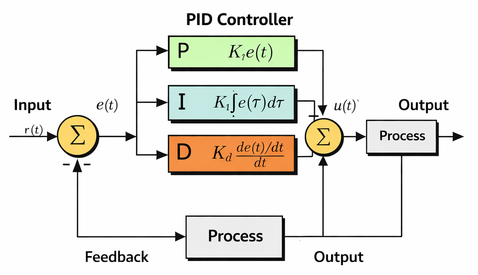
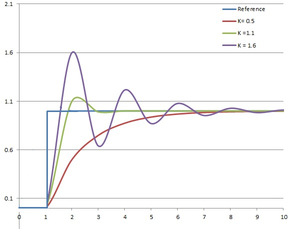
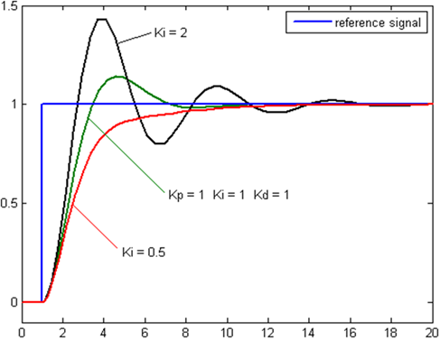
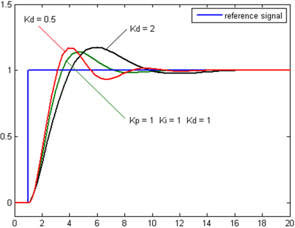

# MPTF Tuning

## PID Controller

MPTF uses PID controller as computation math function to calculate the appropriate out for various thermal scenario. A PID controller is effective for thermal control because it reacts quickly to inputs, corrects long‑term drift, and reduces overshoot for stable operation. By combining proportional, integral, and derivative actions, it helps a system reach and maintain a stable target output accurately.

- Kp – Proportional Gain
- Ki – Integral Gain
- Kd – Derivative Gain

### Proportional Term

- Takes the 𝑒(𝑡) value and applies the proportional value.
- A high proportional value would result in a more larger change and a lower proportional value would result in a smaller change.

### Integral Term

- Takes the integral of 𝑒(𝑡) across an interval, and scales it by the integral gain “Ki”
- Removes the steady state error that’s generated by the proportional term
- Adds overshoot as the integral responds to more accumulated error from integral calculation

### Derivative Term

- Takes the derivative of 𝑒(𝑡) and scales it by the derivative gain “Kd”
- Removes overshoot, and settling time introduced by proportional and integral terms
- If Kd is too large, could introduce stability issues as it anticipates future response

