# MPTF Tuning

## PID Controller

MPTF uses PID controller as computation math function to calculate the appropriate out for various thermal scenario. A PID controller is effective for thermal control because it reacts quickly to inputs, corrects long‑term drift, and reduces overshoot for stable operation. By combining proportional, integral, and derivative actions, it helps a system reach and maintain a stable target output accurately.

- Kp – Proportional Gain
- Ki – Integral Gain
- Kd – Derivative Gain

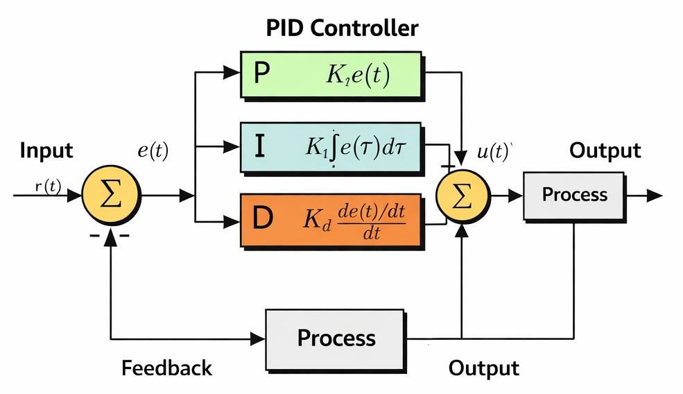

### Proportional Term

- Takes the 𝑒(𝑡) value and applies the proportional value.
- A high proportional value would result in a more larger change and a lower proportional value would result in a smaller change.

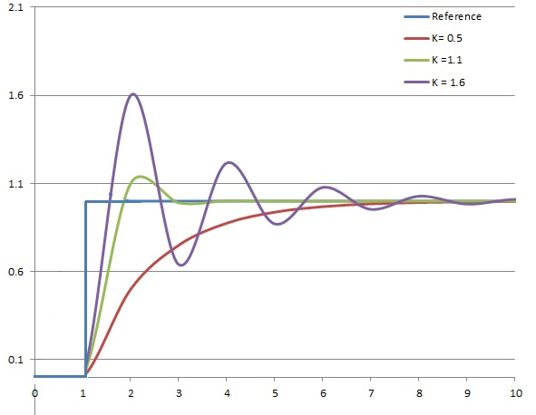

### Integral Term

- Takes the integral of 𝑒(𝑡) across an interval, and scales it by the integral gain “Ki”
- Removes the steady state error that’s generated by the proportional term
- Adds overshoot as the integral responds to more accumulated error from integral calculation

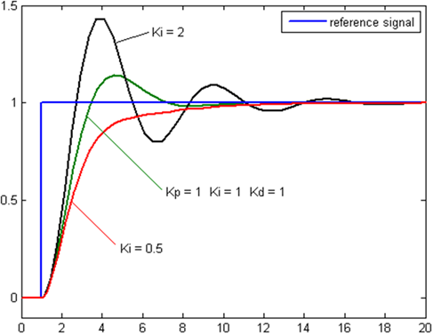

### Derivative Term

- Takes the derivative of 𝑒(𝑡) and scales it by the derivative gain “Kd”
- Removes overshoot, and settling time introduced by proportional and integral terms
- If Kd is too large, could introduce stability issues as it anticipates future response

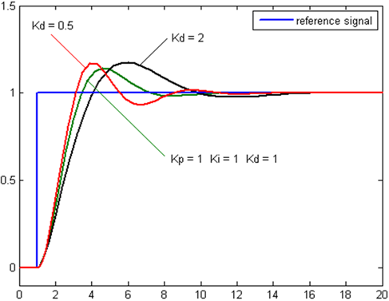

### Manual Tuning Example

This is an example of manually tuning a "skin temperature" scenario where the PID controller is configured to ensure the temperature remains within a targeted range that is safe to be touched. Temperature is control by setting the appropriate power level consumption of the SOC (O_SOC_PL1). Data collected was collected on a lab device and is intended to simulate a real scenario. The MPTF configuration is intended to be used as a reference and not for production.

#### Setup

The Device Under Test is a device that has laptop chassis and is setup with a temperature sensor that is close to the CPU. This ensure the "skin temperature" close to the CPU is always in a safe range. During tuning a benchmark tool is use to trigger a temperature rise by loading the temperature to 100% utilization. Once the temperature value reaches the triggered value of 3170 (Target Temperature - Offset) the PID controller would take effect.

#### Tuning

The following PID controller configuration is used as starting point to maintain a temperature of 3180dK (44.85 °C). The current configuration value used is too high, causing constant overshoot that we are not able to lock into the desired temperature as the correction to the power levels is always either too high or low. This causes constant fluctuation in both temperature and power consumption. As the graph shows the PID controller remains active constantly trying to adjust the power level and the DUT never settles to a stable temperature.

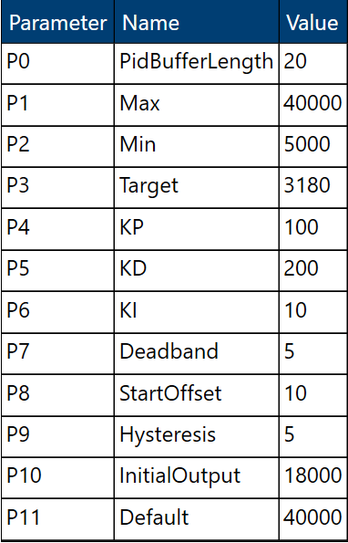

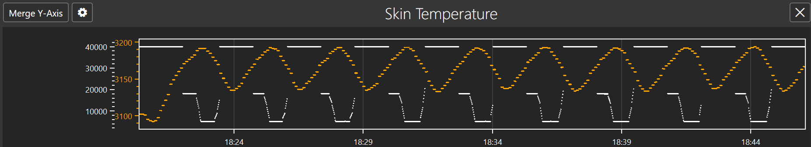

The first step to fix this is to reduce the overshoot. The initial graph also that temperature does not react immediately after power consumption has been increased or reduced. So to take into account the delayed reaction time reduction for both the Proportional (Kp) and Integral (Ki) gains is required. The value of hysteresis is also increased to allow PID controller to remain active as temperature is being adjusted. This avoids falling back to the default maximum power level prematurely when temperature starts dropping. The following configuration shows the updated value.

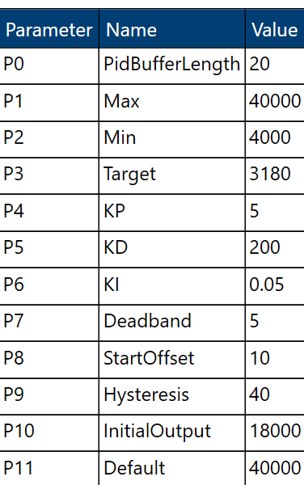

After a while the PID controller is now able to stabilize to the desired temperature target of 180dK (44.85 °C) and has remained stable as the CPU is still being utilized at 100%. At this stage power level is configured to around 26-27mW.

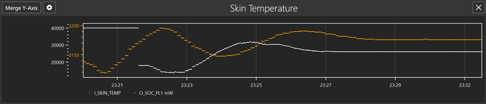

Not that we have found a working PID configuration, it is possible to perform further optimization. The PID configuration had a value of 18mW as an initial output which is the value applied when temperature hits the initial threshold. This value can be adjusted to higher value as the second graph shows temperature reduction on higher power level. Adjusting to higher initial power level improves user experience as a more performant CPU is available. The following graph shows when initial output is set to 22mW where it has similar result as above.

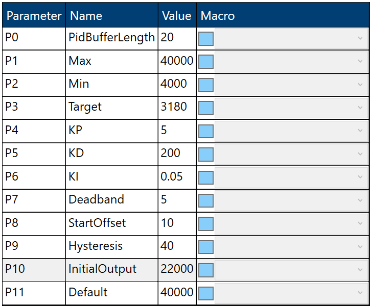

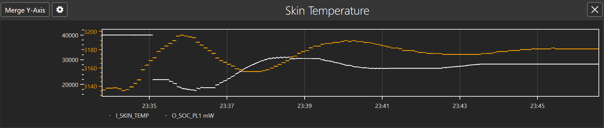

A thermal engineer could perform more fine tuning to eliminate the overshoot completely. The following configuration is used that has reduce the both the Proportional (Kp) and Integral (Ki) gains further to allow a marginal adjustment and avoids the overshoot completely.

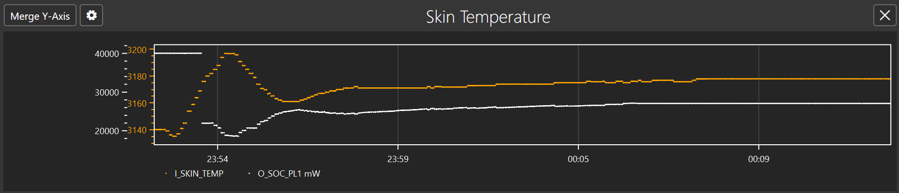

